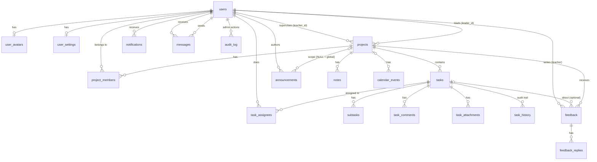

# ProjectPulse — Database Guide

PostgreSQL 13+. One file creates everything: [`schema.sql`](schema.sql) — **19 tables, 4 views, 10 enum types, 13 triggers (8 of them enforce business rules)**.
It is tested by [`tests/integrity_test.sql`](tests/integrity_test.sql) (39 checks that try to *break* each rule).

## 1. What the code analysis found

I read every file of the repo (all 17 JS modules, 14 HTML pages, CSS, docs). The app had **no server and no database**:
everything lived in each browser's `localStorage`, passwords were only base64-encoded (`btoa`, trivially reversible),
and login was checked in the browser. Two users could never see each other's data.

Features that need to be stored (→ table):

| Feature in the app | Table(s) |
|---|---|
| Register / login / profile / suspend / delete users, 4 roles | `users`, `user_avatars` |
| Settings page (dark mode, notification preferences) | `user_settings` |
| Projects, team membership, archive | `projects`, `project_members` |
| Kanban tasks, assignees, subtasks, comments, attachments, history | `tasks`, `task_assignees`, `subtasks`, `task_comments`, `task_attachments`, `task_history` |
| Teacher feedback, ratings, replies, resolve | `feedback`, `feedback_replies` |
| Announcements (global + per project) | `announcements` |
| Notification bell | `notifications` |
| Direct messages | `messages` |
| Project notes (shared / private) | `notes` |
| Calendar | `calendar_events` |
| *(new)* admin audit trail | `audit_log` |

### Gaps between the docs and the real code — and what changed

| # | Finding | Resolution |
|---|---|---|
| 1 | README/docs describe **3 roles**; the code actually has **4** (admin exists). | Schema models all 4. |
| 2 | **"Admin monitors every task" was not implemented**: admin's task/project lists were empty (`forUser` had no admin branch) and the Admin Panel had no task view. | Admin now receives *every* project/task/feedback/history and has an **All Tasks** tab (overdue flags, filters). Read-only: the API rejects admin writes to tasks. |
| 3 | **"Everyone can message everyone" was not true**: messages were limited to people sharing a project; admin could message nobody. | Any user ↔ any active user. |
| 4 | `initAdminPage()` and `initMessagesPage()` were **never called** by `app.js`. The Admin Panel tables never rendered; Messages worked only through a duplicate inline script (using different field names `fromId/toId`) in `messages.html`. | Both registered in the page router; duplicate inline scripts (admin.html, messages.html) removed. |
| 5 | Teacher & Admin accounts could only exist as hard-coded seed data. | Admin creates them in *Admin Panel → Add User* (or `npm run create-user`). |
| 6 | Teachers could post "all students" announcements. You asked for admin-only global announcements. | Global = admin only (enforced in API **and** a DB trigger). Teachers post to their own projects. |
| 7 | Any project could have no teacher; teacher = "first teacher found". | `projects.teacher_id` is required; the project form now has a *Supervising Teacher* dropdown; teachers see only projects they supervise. |
| 8 | "Forgot password" is simulated (no e-mail service). | Admin → *Reset password*. Real e-mail reset = future work. |

## 2. Roles and permissions

| Action | Admin | Teacher | Team Leader | Team Member |
|---|:-:|:-:|:-:|:-:|
| Self-register | – (admin creates) | – (admin creates) | ✔ | ✔ |
| Create / suspend / delete users, reset passwords | ✔ | – | – | – |
| **See every project, task, feedback, history** | ✔ (read-only) | only projects they supervise | only projects they lead | only projects they belong to |
| Create project, add/remove members | – | – | ✔ (own) | – |
| Delete project | ✔ (audit-logged) | – | ✔ (own) | – |
| Create / edit / assign / delete tasks | – | – | ✔ (own projects) | – |
| Update status & progress, subtasks, attachments | – | – | ✔ | ✔ (tasks assigned to them) |
| Comment on a task | – | ✔ (supervised) | ✔ | ✔ (own project) |
| Write feedback | – | ✔ (supervised) | – | – |
| Reply to feedback | – | ✔ | ✔ | ✔ |
| **Publish a global announcement** | ✔ | – | – | – |
| Announce to one project | ✔ | ✔ (supervised) | – | – |
| **Send / receive direct messages with any user** | ✔ | ✔ | ✔ | ✔ |
| Notes, calendar events, own profile & settings | ✔ | ✔ | ✔ | ✔ |

*Where each rule lives:* data-integrity rules (who may be a leader/teacher/assignee, global announcement = admin, feedback only by the
project's teacher, leader can't be removed) are **database triggers** — they hold even if someone bypasses the API.
Who-can-do-what-right-now rules are in `server/src/routes/*` and the read-scoping is one function, `visibleProjectsSql()` in `server/src/fetchers.js`.

## 3. Entity-relationship diagram



## 4. Create the database (step by step)

**Option A — local PostgreSQL**
```bash
createdb projectpulse                                  # or: psql -c "CREATE DATABASE projectpulse"
psql projectpulse -f database/schema.sql               # creates all tables/views/triggers
psql projectpulse -f database/tests/integrity_test.sql # optional: prove the rules work (rolls back, safe)
cd server && cp .env.example .env                      # set DATABASE_URL and JWT_SECRET
npm install
npm run db:seed-demo                                   # optional demo data (password demo123)
npm start                                              # http://localhost:3000
```
**Option B — Neon (free cloud PostgreSQL):** create a project, copy the connection string (ends with `?sslmode=require`)
into `DATABASE_URL`. See [`../DEPLOYMENT.md`](../DEPLOYMENT.md).

You can skip the `psql` step: the server creates the schema automatically the first time it starts on an empty database.

**First administrator** (pick one):
* set `ADMIN_EMAIL` + `ADMIN_PASSWORD` in the environment — created on first start if no admin exists; or
* `cd server && npm run create-user -- --role admin --name "Your Name" --email you@school.edu --password "…"`.

Then sign in → *Admin Panel → Add User* → create your Teachers.

## 5. Handy queries for the admin

```sql
SELECT * FROM v_admin_task_monitor WHERE is_overdue ORDER BY due_date;       -- every overdue task
SELECT * FROM v_project_progress;                                            -- progress per project
SELECT * FROM v_member_stats ORDER BY completed DESC;                        -- workload per student
SELECT * FROM v_platform_stats;                                              -- dashboard numbers
SELECT h.created_at, u.full_name, t.title, h.change                          -- latest activity everywhere
  FROM task_history h JOIN tasks t ON t.id=h.task_id LEFT JOIN users u ON u.id=h.user_id
  ORDER BY h.created_at DESC LIMIT 50;
SELECT created_at, action, details FROM audit_log ORDER BY created_at DESC;  -- admin actions
```
Backup: `pg_dump "$DATABASE_URL" -Fc -f projectpulse.dump` · Restore: `pg_restore -d "$DATABASE_URL" --clean projectpulse.dump`.

## 6. Design decisions worth knowing

* **UUID keys, generated by the browser** → the UI updates instantly and a retried request can't create duplicates.
* **`task_history` is written by the server**, never trusted from the browser, so the audit trail can't be forged.
* **Notifications are created by the server** as side-effects (assignment, feedback, announcement, message); the browser may only create its own "due soon" reminder.
* **Passwords:** bcrypt (cost 10), min 8 characters, never sent back. Login is by e-mail only (the old "login by name" was ambiguous: names aren't unique).
* **Privacy:** members don't receive other people's e-mail/student-ID; DMs are visible only to their two participants (admins included); private notes only to their author.
* **Personal calendar events** (no project) are visible to their creator; admin-created ones to everyone.
* **Avatars** are stored as `bytea` in `user_avatars` (≤ 1 MB) and served by URL, so every page load doesn't download everyone's photo.
* **Attachments:** the app only ever recorded a *file name* (uploads were simulated). Columns for a real file store (`storage_key`, `mime_type`, `size_bytes`) exist but nothing uploads files yet.
* **Schema changes:** this is a single `schema.sql` (v1). For later changes use a migration tool (e.g. `node-pg-migrate`) rather than editing it and re-running.

## 7. Not done / honest limits

* No e-mail (password reset, notifications by mail).
* No real file uploads.
* The browser downloads *everything its user may see* on each page load (fine for a class — hundreds of users, thousands of tasks; for a whole university add pagination).
* Live updates: only the Messages page polls (every 8 s); other pages refresh on reload/navigation.
* Login tokens are kept in browser storage (not an HttpOnly cookie) — acceptable here because the app escapes all user text, but see *Hardening* in `DEPLOYMENT.md`.
